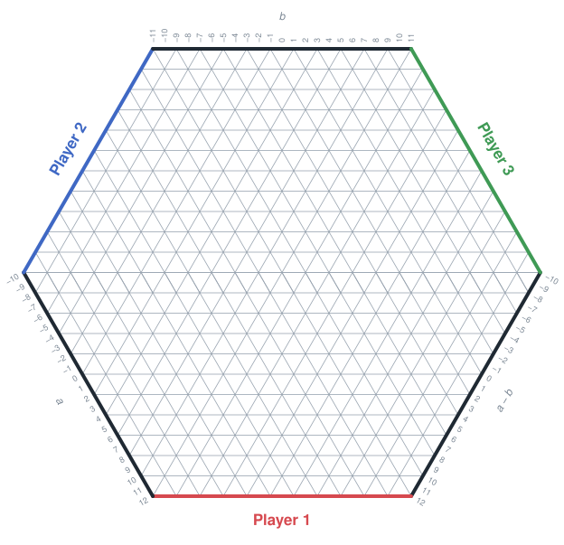
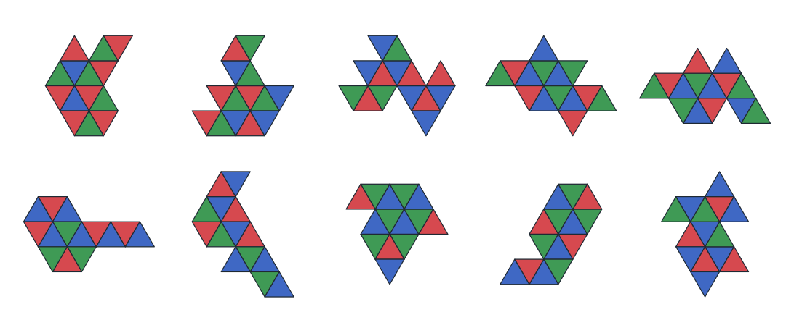
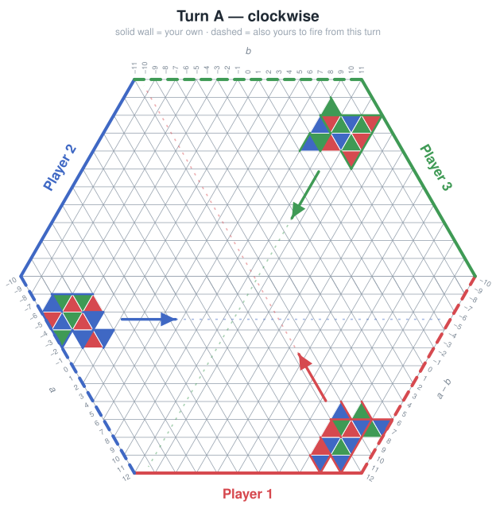
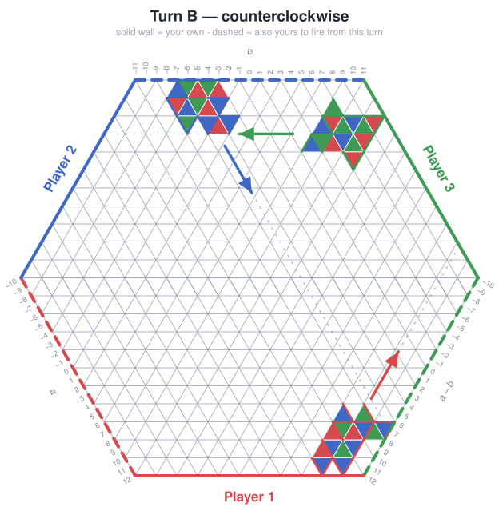

# Blunkychunks

## Description

A 3 player game played on a hexagon shaped grid consisting of triangles. Players
simultaneously fire "blunkychunks" from one of the walls they're defending in
alternating directions, in an attempt to have the triangles which make up said
blunkychunks to hit one of their opponents' walls.

The game procedurally generates blunkychunks for you to fire, so players have a
bank of three blunkychunks they can choose from on a given turn. A turn consists
of choosing the blunkychunk to fire and lining up where they want to fire from.
The direction they fire alternates between clockwise & counterclockwise. At the
end of eight seconds, the choices are locked in and the tiles start sliding in
the given direction.

If blunkychunks are not able to slide in their direction without making contact
with another tile they are (currently) blocked. The triangles retain their
direction and if pieces on the board later clear (described below) then the
triangles will subsequently move.

## The board

The board is a regular hexagon of side 11 cut from a triangular tiling, so it
holds 6 x 11^2 = 726 triangles. Half of them point up and half point down; every
triangle shares each of its three edges with a triangle of the opposite
orientation.

The hexagon has six walls. The three players each defend one wall, and the
three walls in between are neutral:

Player 1 holds the bottom wall; Player 2 and Player 3 follow every other wall
going clockwise. A player's colour is only a label for their wall and their
shots; it has nothing to do with the colours of the triangles.

## Blunkychunks

A blunkychunk is a connected shape made of triangles from the tiling, each
coloured red, green or blue. No two triangles that share an edge may have the
same colour. Chunks are grown procedurally one triangle at a time from a seed,
so the same seed always yields the same chunk; the default size is 14
triangles.

A chunk is never rotated or flipped. It only ever slides, and every slide keeps
each triangle's orientation, so a point-up triangle stays point-up for as long
as it is on the board.

## Firing

Turns alternate between Turn A and Turn B. Together they decide which walls a
player may fire from and which opponent their shot heads toward.

| Turn | Sweep            | Fire from                                              | Shot travels toward                  |
|------|------------------|--------------------------------------------------------|--------------------------------------|
| A    | clockwise        | your own wall, or the neutral wall counterclockwise of it | the opponent clockwise of you        |
| B    | counterclockwise | your own wall, or the neutral wall clockwise of it     | the opponent counterclockwise of you |

On Turn A, Player 1 fires at Player 2, Player 2 at Player 3, and Player 3 at
Player 1. Turn B reverses the whole cycle: 1 at 3, 3 at 2, 2 at 1. The neutral
wall a player borrows on a given turn is on loan to them for that turn only, so
on any turn every wall is spoken for: three owned and three on loan. In the
figures below each player's own wall is solid and the wall on loan to them is
dashed in their colour; the arrows show where each shot is headed.

A chunk always travels straight along one of the tiling's three lattice
directions, each of which runs parallel to one opposite pair of walls. Your
heading is fixed by the turn alone, whichever of your two walls you launch
from: on Turn A Player 1 fires northwest, Player 2 east and Player 3
southwest; on Turn B Player 1 fires northeast, Player 2 southeast and Player 3
west. Fired from your own wall that heading reaches the opponent two walls
around the sweep. Fired from the wall on loan to you, the same heading carries
the chunk to the neutral wall opposite your own instead, so a loaned shot can
never score a hit: it is there to block.

## Placement

To fire, a player picks a chunk from their bank of three, picks one of their two
legal walls, and chooses where along that wall to launch from. The chunk is
placed flush against the launch wall, pressed as far into it as the shape
allows, and may sit anywhere along the wall where the whole chunk fits on the
board. Chunks may not overlap each other or hang off the edge.

All three players place simultaneously, and once the eight seconds are up every
chunk starts sliding in its heading at the same time.

## Clearing triangles

Any time two triangles of the same color share a face, they clear. If this
results in a blunkychunk now being disconnected then it can start moving again
independently of the other blunkychunks which now move/slide independently
(albeit both have the same direction)

## Winning

Each player starts with 10 HP. Every triangle that makes contact with your
opponent's wall and your opponent loses 1 HP and you go up one if you were the
one to have originally fired that blunkychunk. You win if both opponents have HP
<= 0. Players can go negative, but "come back to life" as they are still playing
the game. As long as one other opponent is still in the game.
