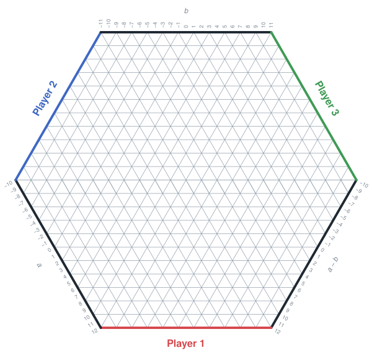
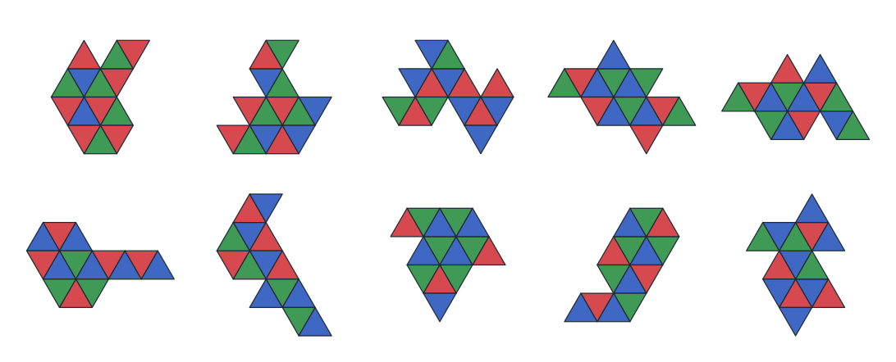
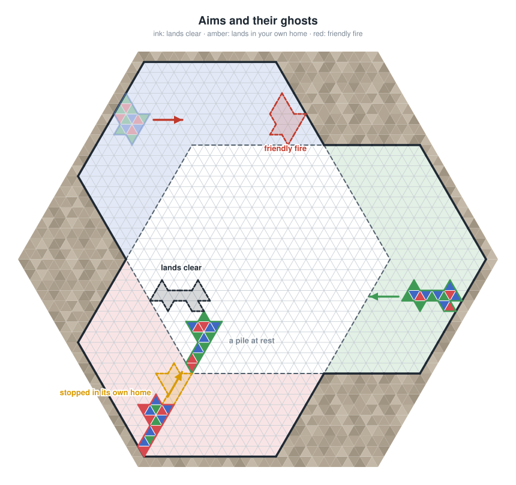

# Blunkychunks

## Description

A 3 player game played on a notched hexagon cut from a triangular tiling. Each
player has a home, a V-shaped lobe outside the dashed middle of the board, and
fires procedurally generated "blunkychunks" from it across the middle at the
other two.

A chunk keeps sliding until something stops it: other triangles, or an
opponent's dashed line. So chunks fired at you pile up against your dashed line,
Tetris style, and the shots you fire back can get stuck in your own home behind
that pile. Your home sits back from the middle, which leaves you some room to
dig your way out by clearing triangles of matching colours. When there is no
room left in your home to place a chunk, you are out. The last player standing
wins.

## The board

The board starts as a hexagon of side 19 with three of its corners notched out.
What is left is a central hexagon of side 11 (the middle, 22 triangles across)
with three homes wrapped around alternate corners of it. Each home is a V
outside two of the middle's walls. Player 1 has the southwest home, and Player
2 (northwest) and Player 3 (east) follow clockwise.

- Your **dashed line** is the two dashed edges between your home and the
  middle.
- Your **back wall** is the rest of your home's outline: the black edge of the
  board, including the two short edges along the notches.

On the default board the middle holds 726 triangles and each home 352, 1782
in all. Other sizes work the same way: the middle's diameter (an even number of
triangles) and the notch can be set when you start the game, e.g.
`make run DIAMETER=12 NOTCH=5`. A middle of side n with notch r has 6n²
triangles in the middle and 4nr in each home. A player's colour is only a label
for their home and their chunks; it has nothing to do with the colours of the
triangles.

## Blunkychunks

A blunkychunk is a connected shape made of triangles from the tiling, each
coloured red, green or blue. No two triangles that share an edge may have the
same colour. Chunks are grown procedurally one triangle at a time from a seed,
so the same seed always yields the same chunk; the default size is 14 triangles.

Before it is fired a chunk may be turned in 60 degree steps. Turning swaps its
point-up and point-down triangles, but it is never flipped over. Once fired it
only slides, and a slide keeps every triangle's orientation.

## Aiming

Each player has a bank of three chunks. Before your shot clock runs out you
choose:

- a chunk from your bank;
- one of its six rotations;
- one of your three headings;
- a spot for it in your home.

A spot must lie wholly inside your home, must not overlap any triangle already
there, and must touch your back wall: at least one triangle of the chunk has a
corner on it.

Your three headings point back across the board from your corner. East fires
southwest, west or northwest; southwest fires northwest, northeast or east;
northwest fires east, southeast or southwest. Straight across (west, for east)
gets out of your home from anywhere in it. Each of the other two runs parallel
to one of your dashed walls, so it only gets out from the far arm of your V.
Fired from the arm it runs along, a chunk slides down that arm into the notch
edge at its end, which is your own back wall.

## The shot clock

Play is continuous. Each player has their own shot clock of 8 seconds: when
yours runs out your aim fires, and your clock starts again straight away. The
clocks are staggered a third of a clock apart, so they run out in turn, Player
1's, then Player 2's, then Player 3's, and someone fires every 2⅔ seconds.
Everyone's first clock is the full 8 seconds, plus 2⅔ for each player before
them. Chunks already on the board keep sliding the whole time. When a chunk is
fired its slot in your bank is refilled with a fresh one.

## Sliding

Every tick (0.28 seconds) each chunk takes one step along its heading. A step
is blocked by:

- a triangle that isn't moving the same way, whether it is the one the chunk
  would land on or the one it would pass over on the way;
- another player's home: chunks stop at an opponent's dashed line, including
  the dashed line of a player who is already out;
- the edge of the board.

Your own dashed line never blocks your chunks. Chunks moving the same way don't
block each other, so a convoy moves together.

When chunks moving different ways would step into the same space, landing on or
passing over the same triangle, and nothing else stops them, the one fired
first takes its step and the others wait. A convoy goes as its earliest-fired
chunk, and the pieces of a chunk that splits count as fired when it was.

A blocked chunk keeps its heading
and moves on as soon as the way clears, so when part of a pile clears, whatever
was stacked behind it slides on.

## Clearing triangles

Whenever two triangles of the same colour from different chunks share an edge,
both clear. This is checked after every tick and as soon as chunks are fired.
If a clear leaves a chunk in pieces, each piece carries on independently with
the same heading.

## The ghost

Before you fire you see a ghost of where your aim will come to rest, in its own
colours, faded. It slides against the chunks currently at rest, and looks
straight through chunks still in flight and through the other players' aims,
which can't be known yet.

On the way it clears just as the real chunk would. A **hit** is a triangle that
meets one of the same colour at rest, as it's fired or after any step: the
ghost shows it in full colour and crossed out, where the two meet. Whatever is
left slides on without it, in pieces if the hit cut it in two, and the ghost
shows where each piece comes to rest.

Its outline's colour says what will happen:

- **Ink:** it lands clear of your home.
- **Amber:** it lands with part of it still in your home, because a pile is in
  the way. That's legal: it stays there, keeps its heading, and is how your
  home fills up.
- **Red:** friendly fire. Some triangle of the chunk can never leave your home
  on this heading, so if nothing stops it for good it will hit your back wall.
  The aimed chunk is greyed out.

## Losing and winning

You are out when either of these happens:

- your shot clock runs out and you have no legal aim, because you ran out of
  time or nothing fits anywhere in your home;
- one of your triangles is stopped by your own back wall.

Only your own back wall counts. At each notch corner the middle's corner
triangles can step straight into the notch, but a chunk stopped there from the
middle has just come to rest like any other.

When you are out, your chunks stay on the board as ordinary obstacles that can
still clear. The last player standing wins. If everyone still in goes out at the
same moment, it's a draw.

## Playing

The game is written in Teal and runs in LÖVE 11.4.

| Command                       | What it does                                           |
| ----------------------------- | ------------------------------------------------------ |
| `make run`                    | open the setup screen, then play (`ARGS="--play"` skips it: you as Player 1 against two bots) |
| `make bots`                   | watch three bots play each other                       |
| `make run DIAMETER=12 NOTCH=5` | play on another size of board (also for `bots`, `soak`, `images`) |
| `make run ARGS="--seed 42"`   | a reproducible match; `--fast` for a 2 second clock, `--size 8` for smaller chunks |
| `make test`                   | the rules engine's tests                               |
| `make soak`                   | whole bot matches played headless, checking the engine |
| `make images`                 | redraw the figures in this README                      |
| `make dist`                   | package standalone builds for macOS, Windows and Linux into `dist/` (`make mac`, `windows`, `linux` or `love` for one) |

| Key                | Does                                |
| ------------------ | ----------------------------------- |
| `1` `2` `3`        | pick a chunk from your bank         |
| `Q` / `E`          | rotate counterclockwise / clockwise |
| `←` `→` or `A` `D` | slide the chunk along your back wall |
| `↑` `↓` or `Tab`   | change heading                      |
| `Space` / `Enter`  | fire now: every clock skips ahead to when yours runs out, so any due sooner fire first (watching `make bots`, `Space` skips to the next shot) |
| `+` / `-`          | slide faster / slower               |
| `R`                | new match                           |
| `Esc`              | back to the setup screen            |

A match starts from the setup screen: pick the board, chunk size and shot
clock, and who plays each home. Every controller shares one cursor: `↑` `↓`
choose a row, `←` `→` change it (on a player's row, cycling between a bot, the
keyboard and each plugged-in gamepad), and `Enter` starts the match (`Esc`
quits). Any gamepad drives the same cursor with its D-pad or stick, seated or
not, and `A` selects the row: it steps an option on, sits that gamepad at a
player's row, or starts the match from Start. A gamepad can also press `Start`
to take the first home a bot has, `Start` again to begin, and `B` or `Back` to
give the home back.

Gamepads can play during a match too, as many as there are bots to take over: press `Start`
on one to take the first bot's home, and `Back` (or unplugging it) hands that
home back to a bot. The legend at the bottom of the screen lists the keys and
buttons for every controller in play.

| Button               | Does                                 |
| -------------------- | ------------------------------------ |
| `X` `Y` `B`          | pick a chunk from your bank          |
| `LB` / `RB`          | rotate counterclockwise / clockwise  |
| D-pad or stick ← →   | slide the chunk along your back wall |
| D-pad or stick ↑ ↓   | change heading                       |
| `A`                  | fire now                             |
| `Start` / `Back`     | join / leave                         |

Holding a slide or a rotate, on the keyboard or a gamepad, keeps it going.

## Ideas

- Lean into the tetris-like quality and control the pieces as they go? If we do
  this then probably the pieces only need to be launched from exactly your side
- Defenses = singleton triangles of your color that your blunkychunks can pass
  through, but others cannot (without clearing them properly). You start the
  game with some and periodically get more that you can place directly onto the
  board on your turn (on your part of the playing field)
- Leaning further into the rotation quality with changing colors
- Having your player color mean something (so your blunkychunks are weighted to
  have more of other people's )
- If a blunkychunk "splits" perhaps it goes in the two other 60deg different
  directions. So if the blunkychunk was originally going east and it splits then
  the upper half starts going northeast and the lower half southeast.
- Points system? Combos for bigger groups and/or perfect fits?
- Theme related to elements with red = fire, earth = green, blue = water. These
  could rotate?
- Monks? Trunks? Junk? Sunk?
